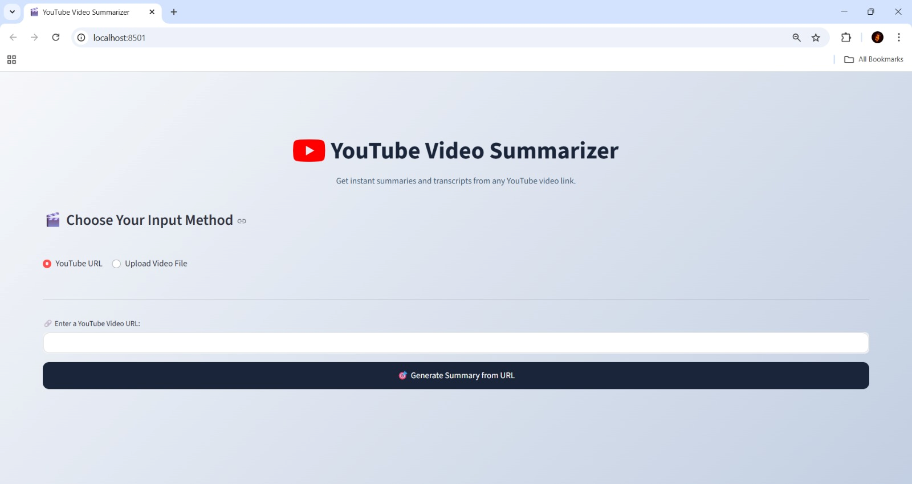

# 🚀 AI YouTube Video Summarizer

An intelligent web application built with Python and Streamlit that generates concise summaries from YouTube videos or local video files. The app uses OpenAI's Whisper for transcription and a Hugging Face Transformer for summarization.



---

## ✨ Key Features

- **Dual Input Support**: Accepts both YouTube URLs and direct video file uploads (MP4, MOV, etc.).
- **Intelligent Transcript Fetching**: Automatically uses existing YouTube transcripts when available for a significantly faster summary.
- **AI-Powered Core**: Leverages OpenAI's Whisper for highly accurate speech-to-text and a Transformer model for high-quality summarization.
- **Custom Interactive UI**: A polished, user-friendly interface with a custom purple theme built using Streamlit.

---

## 🛠️ Tech Stack

- **Language**: Python
- **Web Framework**: Streamlit
- **AI Models**:
  - OpenAI Whisper (Speech-to-Text)
  - Hugging Face Transformers (Summarization)
- **Core Libraries**:
  - `yt-dlp` (YouTube Processing)
  - `ffmpeg-python` (Audio Extraction)

---

## ⚙️ Setup & Installation

To run this project locally, follow these steps:

**1. Clone the repository:**
```bash
git clone [https://github.com/Jitin10/YouTube-Video-Summarizer.git](https://github.com/Jitin10/YouTube-Video-Summarizer.git)
cd YouTube-Video-Summarizer

# For Windows
python -m venv venv
.\venv\Scripts\activate

# For macOS/Linux
python3 -m venv venv
source venv/bin/activate

▶️ How to Run the App
With your virtual environment activated and dependencies installed, run the following command in your terminal:
streamlit run app.py
